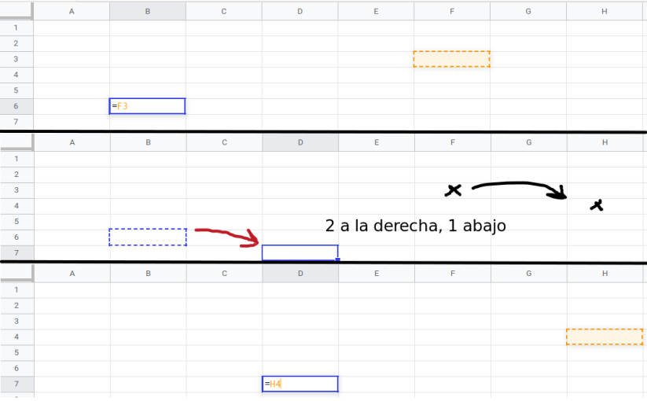

### Referencia
Excel trabaja todo con refencias a celdas o intervalos.  
Es decir: Podés obtener el contenido ***(texto)*** de una celda haciendo referencia a ella.

Hay 4 tipos de referencias:
- **Relativa**
- **Absoluta**
- **Mixto 1** -> Fijar solo columnas.
- **Mixto 2** -> Fijar solo filas.

### Notación de Referencia
El símbolo *`$`* determina que lo que está a su derecha, está fijo.

- Para celda
    ~~~
    =D7          # Relativa
    =$D$7        # Absoluta
    =D$7         # Mixta (Fila fija)
    =$D7         # Mixta (Columna fija)
    ~~~

- Para intervalo finito
    ~~~
    =B2:G8       # Relativa
    =$B$2:$G$8   # Absoluta
    =B$2:G$8     # Mixta (Fila fija)
    =$B2:$G8     # Mixta (Columna fija)
    ~~~

- Para intervalo infinito
    ~~~
    Se puede definir un intervalo como una columna infinita.
    Y al aumentar el número de filas, la fórmula seguirá apuntando hasta el final de la hoja.

    =B2:G        # Relativa
    =$B$2:$G     # Absoluta
    =B$2:G       # Mixta (Fila fija)
    =$B2:$G      # Mixta (Columna fija)
    ~~~

### Relativa
~~~
Si tenemos una referencia relativa a celda en una fórmula, copiamos y pegamos.
La nueva celda apuntará en la misma dirección que la celda original.

Es decir: No apuntamos a una celda en concreto, sino que marcamos la dirección, como flecha, a la cual queremos apuntar.
Como si fueran coordenadas.
~~~

*[Ejemplo](https://docs.google.com/spreadsheets/d/1xxQYGFh37KiMAdwIKkc2ZFeMwpTBRYCxjjtbuIVwhg0/edit#gid=903247812):* Si desde la **celda 1** se hace referencia a la **celda 2**.  
Y supongamos que la **celda 2** está: (4 celdas a la derecha y 3 arriba de la **celda 1**).

Si copiamos y pegamos la fórmula en la **celda 3**, ahora ésta apuntará (4 a la derecha y 3 arriba de donde sea que esté).

### Absoluta
~~~
Si tenemos una referencia absoluta a una celda en una fórmula, copiamos y pegamos.
Si copiamos y pegamos, la nueva celda seguirá apuntando a la misma celda.

Es decir: Las referencias NO cambian.
~~~

[Ejemplo](https://docs.google.com/spreadsheets/d/1xxQYGFh37KiMAdwIKkc2ZFeMwpTBRYCxjjtbuIVwhg0/edit#gid=2139645056) de Absoluta

### Mixto 1 y Mixto 2
~~~
A veces nos puede llegar a interesar que al copiar y pegar una fórmula:
- Se mueva en Filas pero no en Columnas.
- Se mueva en Columnas pero no en Filas.
~~~

*[Ejemplo](https://docs.google.com/spreadsheets/d/1xxQYGFh37KiMAdwIKkc2ZFeMwpTBRYCxjjtbuIVwhg0/edit#gid=0)* de Mixto

